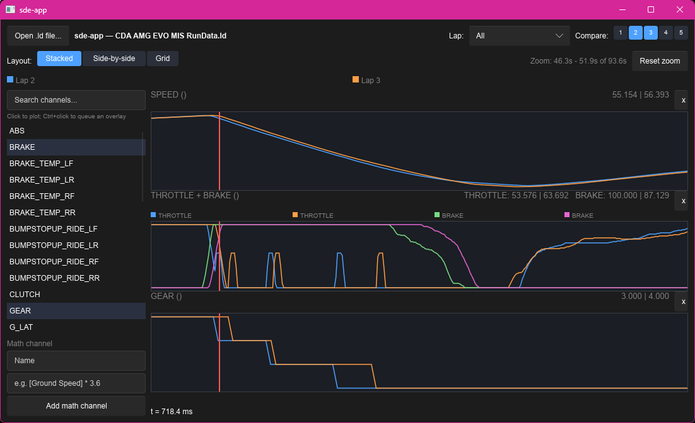

# Shakedown Engineer

A rally race-engineer tool: creating and analyzing vehicle setups per stage
(suspension, ABS/TCS/aero electronics — not just driver performance), for use with
Richard Burns Rally, Dirt Rally, Assetto Corsa Rally, and EA WRC.

Its telemetry log parsing layer (`sde-formats`/`sde-core`) is a Rust + Slint port of
[racer-coder/TrackDataAnalysis](https://github.com/racer-coder/TrackDataAnalysis)
(AiM XRK, MoTeC LD, ECUMaster ADULOG, RaceLogic VBOX, Race Technology RUN, MegaLogViewer
MLG, iRacing IBT) — kept general-purpose and sim-agnostic, since it's the shared
foundation both circuit and rally analysis are built on. The setup/analysis features
built on top of it (`sde-setup`, `sde-analysis`, per-sim setup adapters) are where the
project diverges from a straight port and focuses specifically on rally.

See [`PROJECT_PLAN.md`](./PROJECT_PLAN.md) for full architecture, crate layout,
milestone sequence, and format-validation notes. That file is the source of truth for
scope and design decisions — this README is just the quick-start.



## Status

Milestone 1–5 done: MoTeC `.ld` parsing, the core session data model, and a Slint GUI
with worksheets/docks, channel search, lap selection/comparison, math channels, and
timeline zoom/pan. See `PROJECT_PLAN.md`'s milestone checklist for current progress.

## Workspace layout

```
crates/
├── sde-formats/motec/   # MoTeC .ld binary parser (binrw-based), UI-free
├── sde-core/            # Session/Channel/Lap data model, wraps sde-formats
├── sde-cli/             # `dump_channels` example binary
└── sde-app/             # Slint GUI shell
```

Future crates (not yet started): `sde-setup`, `sde-analysis`, `sde-gis`, `sde-video`,
and additional `sde-formats::<format>` parsers.

## Building

Requires a stable Rust toolchain (install via [rustup](https://rustup.rs/)).

```sh
cargo build --workspace
cargo test --workspace
cargo clippy --workspace --all-targets
```

## CLI example

```sh
cargo run -p sde-cli --bin dump_channels -- path/to/log.ld
```

Prints driver/vehicle/venue metadata, lap count, and each channel's name, unit,
sample count, and first few values.

## Contributing

See [`CONTRIBUTING.md`](./CONTRIBUTING.md) for build/test/lint requirements and workspace
conventions. This project follows a [Code of Conduct](./CODE_OF_CONDUCT.md).

## Reference repos

Local clones used for format validation and domain modeling (see `PROJECT_PLAN.md`
for details on how each was used):

- `../TrackDataAnalysis` — the original Python tool this project's telemetry parsing
  layer ports; primary oracle for the MoTeC LD format (`data/motec.py`, `data/base.py`).
- `../ldparser` — independent MoTeC LD parser, used for cross-validation and to
  generate synthetic test fixtures.
- `../race-engineer` — RBR domain model reference (`docs/data-model-rbr.md`) for the
  future `sde-formats::rbr` setup-file adapter.
